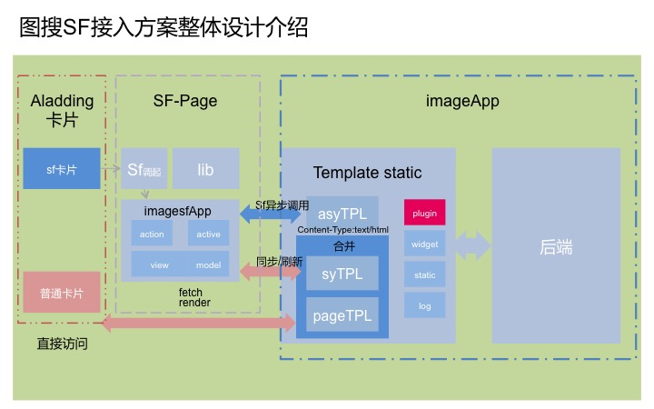

# fis-superframe产品线接入解决方案

为了支持superframe项目，并且减少产品线接入的改成本，达到产品线站内页面与sf页面通过一次fis编译、共同产出所需页面，避免产品线站内与sf页面需要开发两套业务代码而提供的fis-superframe产品线解决方案，目前只针对fis3-smarty开放。

##方案设计
superframe能够为阿拉丁导入产品线提供连贯性的动作，提升用户访问体验和访问速度。

	直接访问：superframe要求直接在阿拉丁卡片唤起sf框架向其他产品线发送跨域xhr请求，返回superframe要求格式的异步页面template片段组合，然后sf为产品线异步模板提供展现舞台，用户在舞台内浏览，当用户跳出页面时候，销毁场景，推出舞台。

	刷新访问：如果用户已经停留在superframe打开的页面，再次刷新后根据url进行302跳转到产品线提供的产品线站内同步页面。

产品线站内只需要根据superframe项目组提供<a href="http://gitlab.baidu.com/superframe/superframe/wikis/specs-of-service">sf规范</a>进行改造，新建一个提供给sf的template模板，新建模板与站内模板使用相同widget即可实现一次fis编译后，站内与sf代码共享。通过整体接入方案设计图可以发现本插件即是放入产品线站内plugin里面的php插件。

	

##使用方法
根据superframe规范要求提供的产品线异步页面template模板格式如下：
	

	<template id="sf_async_head_js">
        
    </template>
    <template id="sf_async_css">
        
        <link href="https://some.host/some/path/some.css" rel="stylesheet" type="text/css" />
    </template>
    <template id="sf_async_body">
        
各种dom

        
    </template>

1、我们只需要在自己产品线module里面新建异步模板asyTpl.tpl,具体内容根据产品线自身内容放置，参考内容如下：

	
	

    
    	
    	<!--[FIS_CSS_LINKS_HOOK]-->
    

    <template id="sf_async_head_js">
        
        
    </template>

    <template id="sf_async_body">
        

            <section id="mainsearch" class="mainsearch" style="display:none;">
                
                
                
            </section>
        

        
        <JS_FRAMEWORK_HOOK/> 
    </template>
    
		
    

2、将pulgin里面的文件替换到产品线的smarty的plugin下即可。

3、注意调试的时候产品线自身页面功能与sf模板同时回归。

##线上效果

	

